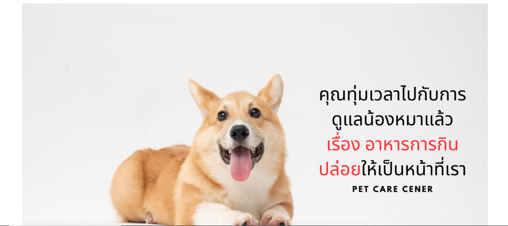
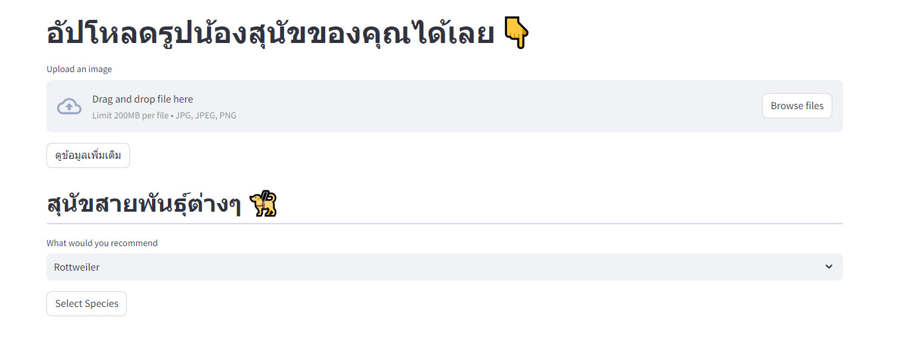
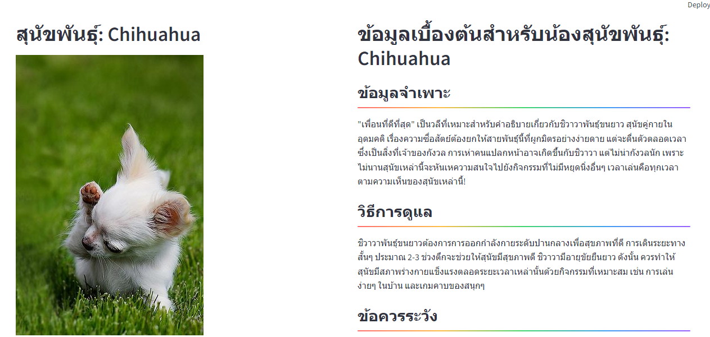
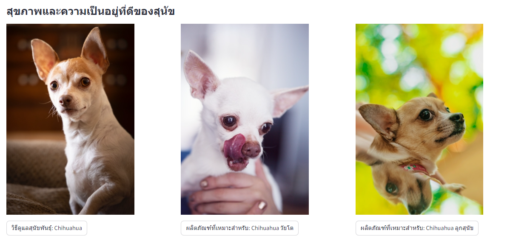

# DogDetective

### **Project DogDeective**

In this project, I implemented an Image Classification system named DogDetective, focusing on recognizing and classifying various breeds of dogs using Convolutional Neural Networks (CNN). The inspiration for this project came from Pedigree, which developed a concept of advertising booths in public areas where dog owners frequent. The booths utilize a system to predict the breed of a dog walking nearby and recommend suitable products for that specific breed.

The key differentiator in my project lies in its utilization of dog images for classification. Users can upload a photo of their dog, and the system predicts the breed while providing detailed information about that specific breed. Additionally, the system offers insights on what to watch out for in that breed and recommends appropriate products for the dog.

The CNN employed in this project consists of two main parts. Firstly, Feature Extraction utilizes image processing principles to identify salient features in the image, including borders, lines, curves, and slanted lines. Subsequently, Part 2 involves processing these extracted features in Neural networks. Notably, Transfer Learning is integrated into the model, a technique that involves taking a pre-trained model, like VGG16 in this case, modifying certain aspects, and training it with a smaller dataset.

The results of this project are highly satisfactory, with an accuracy rate of 0.72. This indicates that the model performs quite well in predicting dog breeds from images. The DogDetective system, therefore, represents a valuable tool for dog owners, providing accurate breed predictions, detailed information, and personalized product recommendations based on the specific needs of their furry companions.

### **How to Use**
1. Open the command prompt (cmd) and navigate to the folder where you want to store the project. For example, use the following command: cd 'path/to/your/directory'
2. Clone the project repository by entering the command: git clone https://github.com/alexday11/DogDetective_.git
3. Move into the project directory: cd 'DogDetective'
4. Install the required dependencies by running: pip install -r requirements.txt
5. Return to the command prompt and start the app with the following command: streamlit run app.py

